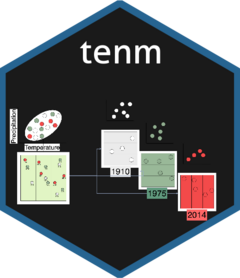

<!-- README.md is generated from README.Rmd. Please edit that file -->

```{r, include = FALSE}
knitr::opts_chunk$set(
  collapse = TRUE,
  comment = "#>",
  fig.path = "man/figures/README-",
  out.width = "100%"
)
rgl::setupKnitr()
set.seed(123)
```

# tenm <a href="https://luismurao.github.io/tenm/"></a>

<!-- badges: start -->
[](https://CRAN.R-project.org/package=tenm)
[](https://github.com/luismurao/tenm/actions/workflows/R-CMD-check.yaml)
[](https://app.codecov.io/gh/luismurao/tenm?branch=main)
<!-- badges: end -->

An R package with a set of functions to calibrate time-specific ecological 
niche models. Time-specific niche modeling (TENM) is a novel approach that allows calibrating niche models with high temporal resolution spatial information, which aims to reduce niche estimation biases. Although TENM could improve distribution estimates, few works have used them. The goal of `tenm` R package is to provide methods and functions to calibrate time-specific niche models, letting users execute a strict calibration and selection process of niche models based on ellipsoids, as well as functions to project the potential distribution in the present and in global change scenarios.


## Installation

You can install the development version of tenm from [GitHub](https://github.com/) with:

``` r
if (!require('devtools')) install.packages('devtools')
devtools::install_github("luismurao/tenm")
# If you want to build vignette, install pandoc before and then
devtools::install_github('luismurao/tenm',build_vignettes=TRUE)
```

## Example

We start with a simple example to show the basic functions of the package. We 
will work with a dataset of [*Abronia graminea*](https://es.wikipedia.org/wiki/Abronia_graminea), an endemic lizard from the Mexican Sierra Madre Oriental.

First, we load the `tenm` R package.

```{r example}
library(tenm)
## basic example code
```

Now we load the `abronia` dataset, which contains geographical information about
the presence of *Abronia graminea* in its area of distribution. This dataset has
also information about the year of observation and the [GBIF](https://www.gbif.org) doi.

```{r cars}
data("abronia")
head(abronia)
dim(abronia)
```

We plot the geographic information to see how *Abronia graminea* is 
distributed.


```{r pressure, echo = TRUE,fig.cap="Fig. 1. Occurrence points of *Abronia graminea*. Colors represent the year of observation.",results='asis'}
colorss <- hcl.colors(length(unique(abronia$year)))
par(mar=c(4,4,2,2))
plot(abronia$decimalLongitude, abronia$decimalLatitude,
     col=colorss,pch=19, cex=0.75,
     xlab="Longitude",ylab="Latitude",xlim=c(-98.35,-96.7))
legend("bottomleft",legend = sort(unique(abronia$year))[1:20],
       cex=0.85,pt.cex = 1,bty = "n",
       pch=19,col =colorss[1:20])
legend("bottomright",
       legend = sort(unique(abronia$year))[21:length(unique(abronia$year))],
       cex=0.85,pt.cex = 1,bty = "n",
       pch=19,col =colorss[21:length(unique(abronia$year))])
```

**Note that some occurrences are overlapped but belong to different years**. 

### Standard data thinning

A relevant step when curating occurrence data is to eliminate duplicated 
geographical information, which depends on several factors, including spatial 
autocorrelation and the spatial resolution of the modeling layers. Let's see
what happens when we eliminate duplicated information as defined by the
spatial resolution of our modeling layers. To do this, we will use the 
`tenm::clean_dup` function of the `tenm` R package.

```{r}
# Load a modeling layer 
tempora_layers_dir <- system.file("extdata/bio",package = "tenm")
tenm_mask <- terra::rast(file.path(tempora_layers_dir,"1939/bio_01.tif"))

ab_1 <- tenm::clean_dup(data =abronia,
                        longitude = "decimalLongitude",
                        latitude = "decimalLatitude",
                        threshold = terra::res(tenm_mask),
                        by_mask = FALSE,
                        raster_mask = NULL)
tidyr::as_tibble(ab_1)
```

After applying our spatial thinning, we obtained only ten observations from 
`r nrow(abronia)` occurrences. We lost a lot of information!!! The function
`tenm::clean_dup` has a method to clean duplicated records according to a raster
mask layer. The above avoids losing records that might occur in different pixels
but fall within the distance used as threshold for cleaning.

```{r}
ab_by_mask <- tenm::clean_dup(data =abronia,
                              longitude = "decimalLongitude",
                              latitude = "decimalLatitude",
                              threshold = terra::res(tenm_mask),
                              by_mask = TRUE,
                              raster_mask = tenm_mask)
tidyr::as_tibble(ab_by_mask)
```

We recovered `r nrow(ab_by_mask) - nrow(ab_1)` records, not bad! On the other
hand, we did not account for the fact that some occurrences come from 
different years. The `tenm` package is designed to deal with occurrences
coming from different periods as long as the user has environmental
layers matching the years of occurrence observations.

## Time-specific niche modeling

Let's apply the functions and methods to work with time-specific niche models.
First, we load our data.

```{r}
library(tenm)
data("abronia")
```

Now, we indicate the path where our time-specific modeling layers are located.

```{r}
tempora_layers_dir <- system.file("extdata/bio",package = "tenm")
print(tempora_layers_dir)
```

We explore the structure of the directory that contains our modeling layers.

```{r}
list.dirs(tempora_layers_dir,recursive = FALSE)
```

**Note that the directory contains other directories named with the dates of
the modeling layers**. Now, we explore some of these dated directories. 

```{r}
# Directory for year 1939
list.files(list.dirs(tempora_layers_dir,
                     recursive = FALSE)[1],
           pattern = ".tif$")
# Directory for year 1972
list.files(list.dirs(tempora_layers_dir,
                     recursive = FALSE)[10],
           pattern = ".tif$")
# Directory for year 2014
list.files(list.dirs(tempora_layers_dir,
                     recursive = FALSE)[30],
           pattern = ".tif$")

```

**Note that all dated directories must have the same environmental**
**information.** In this example, we used the bioclimatic layers derived from 
the [CHELSAcruts](https://chelsa-climate.org/chelsacruts/) database. 

### The *sp.temporal.modeling* object

In the following lines of code, we will use a special function of the `tenm`
R package that will allow us to work with time-specific data.

```{r}
data("abronia")
tempora_layers_dir <- system.file("extdata/bio",package = "tenm")
abt <- tenm::sp_temporal_data(occs = abronia,
                              longitude = "decimalLongitude",
                              latitude = "decimalLatitude",
                              sp_date_var = "year",
                              occ_date_format="y",
                              layers_date_format= "y",
                              layers_by_date_dir = tempora_layers_dir,
                              layers_ext="*.tif$")
```

The function `tenm::sp_temporal_data` is parametrized with the occurrence 
dated database. To parametrize the function, we need to specify the name of
the columns that contain the longitude and latitude data, the column that 
represents the year of observation, the format of dates (here years, but
see the help of the function for other date formats), the layers date format,
the directory that contains the time-specific modeling layers and the 
raster layer extension. 

The object `abt` is a special class called *sp.temporal.modeling* that 
deals with time-specific information.

In the following line of code, we explore the slots of `abt` object.

```{r}
# See the names of the slots
names(abt)
```

The `abt` object has four slots: temporal data.frame ("temporal_df"), 
a character vector indicating the date variable ("sp_date_var"), 
a character vector showing the names of longitude and latitude data
("lon_lat_vars") and another character vector with the extension of the 
modeling layers.

Now, we explore the temporal_df slot, which is a data.frame with five columns:
longitude, latitude, the time variable (here year), the layer dates, and layers
path (the path the temporal niche layers are located).

```{r}
# See the temporal data.frame
tidyr::as_tibble(head(abt$temporal_df))
```

### Time-specific spatial data thinning

As a first step, we will curate our time-specific database using the function 
`tenm::clean_dup_by_date`. This function is parametrized as the 
`tenm::clean_dup` function with the difference that it thins the data 
considering the time variable (some occurrences might be spatially duplicated 
but belong to other dates,  so in a time-specific context, they are 
not duplicates).

```{r}
# Clean duplicates using a raster mask
abtc <- tenm::clean_dup_by_date(this_species = abt,
                                by_mask = TRUE,
                                threshold = terra::res(tenm_mask)[1],
                                raster_mask = tenm_mask[1],
                                n_ngbs = 0)
# Check number of records
head(tidyr::as_tibble(abtc$temporal_df))
nrow(abtc$temporal_df)
```

An improvement of this methodology is that we recover a lot of information. 
From `r nrow(ab_1)` records thinned using the standard data cleaning process,
now we have `r nrow(abtc$temporal_df)` records; 
`r nrow(abtc$temporal_df) - nrow(ab_1)` more observations!!! which will allow 
us to fit more informative models. Let's compare occurrences from the 
standard data cleaning process and the time-specific thinning process.

```{r,fig.cap="Fig. 2. Comparison of the spatial distribution of occurrence records for the standard thinning processs and the time-specific thinning process. Left panel shows the records after the standard thinning process. Right panel shows the spatial distribution of the records after the time-specific thinning process; note that some records overlap but are from different years."}

colors1 <- hcl.colors(length(unique(ab_1$year)))
par(mar=c(4,4,2,2),mfrow=c(1,2))
plot(ab_1$decimalLongitude, ab_1$decimalLatitude,
     col=colors1,pch=19, cex=0.75,
     xlab="Longitude",ylab="Latitude",xlim=c(-98.35,-96.7))
legend("bottomleft",legend = sort(unique(ab_1$year))[1:10],
       cex=0.85,pt.cex = 1,bty = "n",
       pch=19,col =colors1[1:10])
colors2 <- hcl.colors(length(unique(abtc$temporal_df$year)))
plot(abtc$temporal_df$decimalLongitude, abtc$temporal_df$decimalLatitude,
     col=colors2,pch=19, cex=0.75,
     xlab="Longitude",ylab="Latitude",xlim=c(-98.35,-96.7))
legend("bottomleft",legend = sort(unique(abtc$temporal_df$year))[1:16],
       cex=0.85,pt.cex = 1,bty = "n",
       pch=19,col =colors2[1:16])
legend("bottomright",
       legend = sort(unique(abronia$year))[17:length(unique(abtc$temporal_df$year))],
       cex=0.85,pt.cex = 1,bty = "n",
       pch=19,col =colors2[17:length(unique(abtc$temporal_df$year))])
```

### Time-specific environmental data extraction

After the spatial thinning process, we need to extract environmental information
from our occurrence points. The `tenm` package does this using the function
`tenm::ex_by_date`. This function can be run in parallel by evoking functions 
of the `future` package. To parametrize the function, we need to specify the
"sp.temporal.modeling" object (obtained using the function 
`tenm::sp_temporal_data` or the one from `tenm::clean_dup_by_date`) and the
proportion of occurrences to be used as the training dataset. The `tenm` package
uses a random partition to divide the database into train and test datasets.

```{r}
future::plan("multisession",workers=2)
abex <- tenm::ex_by_date(this_species = abtc,
                         train_prop=0.7)
future::plan("sequential")
```

Now, we explore the slot "temporal_df".

```{r}
head(abex$temporal_df)
```

It has `r nrow(abex$temporal_df)` rows and columns with the time-specific 
environmental values and an additional column indicating if the observation
will be used as train or test.

###  Time-specific background generation

The `tenm` package uses environmental background to compute the ROC and
partial ROC test and estimate the prevalence of the species in the 
environmental space (proportion of environmental points inside the niche model).
We will generate 10,000 environmental background points using as calibration area and a neighborhood of 10 pixels around each occurrence point 
(buffer_ngbs parameter).


```{r}
future::plan("multisession",workers=2)
abbg <- tenm::bg_by_date(this_species = abex,
                         buffer_ngbs=10,n_bg=10000)
future::plan("sequential")
head(abbg$env_bg)
```

**The number of background points for each year is proportional to the number of
occurrences for each year of observation.**

### Exporting time-specific information as Samples With Data format

Although the package uses minimum volume ellipsoids to model the niche, it has
a function to export the time-specific data to Samples With Data format table 
that allows users to fit other algorithms such as MaxEnt. 
Let's see how it works.

```{r}
# SWD table for occurrence records
occ_swd <- tdf2swd(this_species=abex,sp_name="abro_gram")
# SWD table for background data
bg_swd <- tdf2swd(this_species=abbg)
head(tidyr::as_tibble(occ_swd))
head(tidyr::as_tibble(bg_swd))
```

### Time-specific model calibration and selection

As a final step, we will calibrate time-specific niche models using minimum
volume ellipsoids. To achieve this, we first select the environmental variables
using the function `tenm::correlation_finder`. This function filters variables
according to a correlation threshold, which is important to avoid issues 
related to collinearity.

```{r}
varcorrs <- tenm::correlation_finder(environmental_data =
                                       abex$env_data[,-ncol(abex$env_data)],
                                     method = "spearman",
                                     threshold = 0.8,
                                     verbose = FALSE)
# Selected variables
vars2fit <- varcorrs$descriptors
print(vars2fit)
```

Now, we use the function `tenm::tenm_selection` to calibrate the time-specific 
niche models. This function uses the background object (here, the `abbg` object)
as input. To parametrize the function, we need to specify the omission rate
criteria to be used to select the models, the proportion of points to be 
included in the ellipsoid model (*ellipsoid_level* parameter), the names of
the modeling layers (*vars2fit* parameter), a numeric vector indicating the 
number of dimensions used to build ellipsoid models (*vars2fit* parameter)
a logical argument that determines whether to use the partial ROC test or not,
the random percent of data to be used for the bootstrap of the partial ROC test
(*RandomPercent* parameter), the number of iterations of the partial ROC test 
(*NoOfIteration* parameter), a logical argument to specify whether to run the 
calibration process in parallel and the number of cores used in the parallel 
process (*parallel* parameter).

```{r}
mod_sel <- tenm::tenm_selection(this_species = abbg,
                                omr_criteria =0.1,
                                ellipsoid_level=0.975,
                                vars2fit = vars2fit,
                                nvars_to_fit=c(2,3,4,5,6,7),
                                proc = T,
                                RandomPercent = 50,
                                NoOfIteration=1000,
                                parallel=TRUE,
                                n_cores=4)
```

We fitted 492 models, from which 27 passed our selection criteria. Let's explore
the `mod_sel` object.

```{r}
names(mod_sel)
```

It has five slots. We can obtain the table of results of the selection process
by calling the `mods_table` slot.

```{r}
head(mod_sel$mods_table,27)
```

### Projecting time-specific niche models

To project the models, we use the `predict` method. Here, we will project 
one of the selected models using the environmental layers of 2016. Also, we 
project it using layers from a period that comprehends 1970-2000.

```{r rgl=TRUE, dev='png',fig.cap= "Fig. 3. A selected niche model projected using environmental layers from 2016."}
env_layers_2016 <- list.dirs(tempora_layers_dir,
                     recursive = FALSE)[32]
suit_2016 <- predict(mod_sel,
                     model_variables = c("bio_01","bio_03","bio_12"),
                     layers_path =env_layers_2016 ,
                     layers_ext = ".tif$")
```

Now for the period that comprehends 1970-2000.

```{r rgl=TRUE, dev='png', fig.cap= "Fig. 4. A selected niche model projected using environmental layers from 1970-2000."}
layers_70_00_dir <- system.file("extdata/bio_1970_2000",package = "tenm")
suit_1970_2000 <- predict(mod_sel,
                          model_variables = c("bio_01","bio_03","bio_12"),
                          layers_path = layers_70_00_dir,
                          layers_ext = ".tif$")
```

Lets see the predictions in geographic space

```{r, fig.cap= "Fig. 5. Geographic projection of a selected model. Left panel, the projection using environmental layers from 2016. Right panel, the projection using environmental layers from 1970-2000"}
par(mfrow=c(1,2), mar=c(4,4,2,2))
terra::plot(suit_2016, main="Prediction for 2016")
terra::plot(suit_1970_2000, main="Prediction for 1970-2000")
```

### Comparing time-specific niche model vs. standard niche model

The following lines of code show the differences of a time-specific niche model
and a standard niche model. 

```{r rgl=TRUE, dev='png', fig.cap= "Fig. 6. Time-specific niche model vs. standard niche model. Pink ellipsoid represents the time-specific niche model. Green ellipsoid represents a ellipsoid model fitted using the standard approach."}
layers_70_00_dir <- system.file("extdata/bio_1970_2000",package = "tenm")
layers_70_00_path <- list.files(layers_70_00_dir,
                                pattern = ".tif$",full.names = TRUE)
# Extract environmental information 
elayers_70_00 <- terra::rast(layers_70_00_path)
e_trad <- terra::extract(elayers_70_00,
                         ab_1[,c("decimalLongitude","decimalLatitude")])
rgl::view3d(theta = 0, phi = -60,fov=120, zoom = 0.7) 
tenm::plot_ellipsoid(x = e_trad$bio_01,y=e_trad$bio_03,z=e_trad$bio_12,
                     col = "#1B9E77",
                     xlab = "Bio 1",
                     ylab = "Bio 3",
                     zlab = "Bio 12",)
tenm::plot_ellipsoid(x = abbg$temporal_df$bio_01,
                     y = abbg$temporal_df$bio_03,
                     z = abbg$temporal_df$bio_12,
                     col = "#E7298A",
                     add = TRUE)


```

Note that both ellipsoids differ in size and shape. In standard approach 
(green ellipsoid), we can see an sub-estimation of the environmental values
where the intrinsic growth rate might be positive.

## Acknowledgments


CONACYT Ciencia de Frontera CF-2023-I-1156. Laboratorio Nacional Conahcyt de 
Biología del Cambio Climático, México. To PAPIIT-UNAM IA202824 and 
PAPIIT-UNAM IA203922. RGCD thanks the Universidad Nacional Autónoma de México 
(Dirección General de Asuntos del Personal Académico, DGAPA-UNAM, México) for 
her postdoctoral scholarship. 
