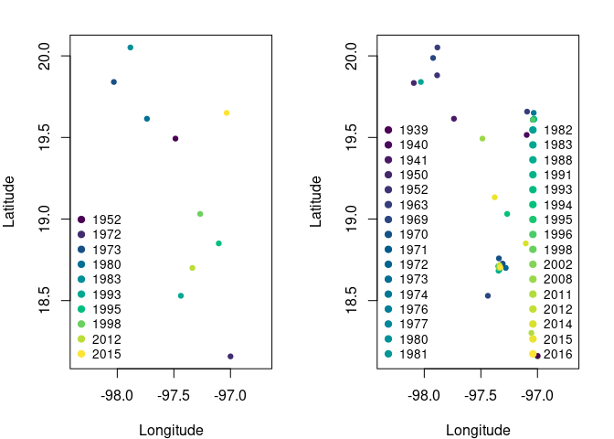

 The main propose of this package is the capability of run time-specific
 ecological niche models.
```{r, include = FALSE}
knitr::opts_chunk$set(
  collapse = TRUE,
  dpi = 200,
  comment = "#>"
)
```

---

We start with a simple example to show the basic functions of the
package. We will work with a dataset of [*Abronia
graminea*](https://es.wikipedia.org/wiki/Abronia_graminea), an endemic
lizard from the Mexican Sierra Madre Oriental.

First, we load the `tenm` R package.

``` r
library(tenm)
## basic example code
```

Now we load the `abronia` dataset, which contains geographical
information about the presence of *Abronia graminea* in its area of
distribution. This dataset has also information about the year of
observation and the [GBIF](https://www.gbif.org) doi.

``` r
data("abronia")
head(abronia)
#>            species decimalLongitude decimalLatitude year
#> 1 Abronia graminea        -98.17773        19.96523 2014
#> 2 Abronia graminea        -98.13753        19.87006 2014
#> 3 Abronia graminea        -98.07042        19.89668 2014
#> 4 Abronia graminea        -98.13003        19.86861 2014
#> 5 Abronia graminea        -98.14894        19.84450 2014
#> 6 Abronia graminea        -98.15909        19.86878 2014
#>                             gbif_doi
#> 1 https://doi.org/10.15468/dl.teyjm9
#> 2 https://doi.org/10.15468/dl.teyjm9
#> 3 https://doi.org/10.15468/dl.teyjm9
#> 4 https://doi.org/10.15468/dl.teyjm9
#> 5 https://doi.org/10.15468/dl.teyjm9
#> 6 https://doi.org/10.15468/dl.teyjm9
dim(abronia)
#> [1] 106   5
```

We plot the geographic information to see how *Abronia graminea* is
distributed.

<div class="figure">


<p class="caption">
Fig. 1. Occurrence points of *Abronia graminea*. Colors represent the
year of observation.
</p>

</div>

**Note that some occurrences are overlapped but belong to different
years**.

### Standard data thinning

A relevant step when curating occurrence data is to eliminate duplicated
geographical information, which depends on several factors, including
spatial autocorrelation and the spatial resolution of the modeling
layers. Let’s see what happens when we eliminate duplicated information
as defined by the spatial resolution of our modeling layers. To do this,
we will use the `tenm::clean_dup` function of the `tenm` R package.

``` r
# Load a modeling layer 
tempora_layers_dir <- system.file("extdata/bio",package = "tenm")
tenm_mask <- terra::rast(file.path(tempora_layers_dir,"1939/bio_01.tif"))

ab_1 <- tenm::clean_dup(data =abronia,
                        longitude = "decimalLongitude",
                        latitude = "decimalLatitude",
                        threshold = terra::res(tenm_mask),
                        by_mask = FALSE,
                        raster_mask = NULL)
tidyr::as_tibble(ab_1)
#> # A tibble: 10 × 5
#>    species          decimalLongitude decimalLatitude  year gbif_doi             
#>    <chr>                       <dbl>           <dbl> <int> <chr>                
#>  1 Abronia graminea            -97.5            19.5  1995 https://doi.org/10.1…
#>  2 Abronia graminea            -97.0            18.2  1993 https://doi.org/10.1…
#>  3 Abronia graminea            -98.0            19.8  1980 https://doi.org/10.1…
#>  4 Abronia graminea            -97.7            19.6  2012 https://doi.org/10.1…
#>  5 Abronia graminea            -97.9            20.1  2015 https://doi.org/10.1…
#>  6 Abronia graminea            -97.4            18.5  1952 https://doi.org/10.1…
#>  7 Abronia graminea            -97.1            18.9  1998 https://doi.org/10.1…
#>  8 Abronia graminea            -97.3            19.0  1983 https://doi.org/10.1…
#>  9 Abronia graminea            -97.3            18.7  1973 https://doi.org/10.1…
#> 10 Abronia graminea            -97.0            19.7  1972 https://doi.org/10.1…
```

After applying our spatial thinning, we obtained only ten observations
from 106 occurrences. We lost a lot of information!!! The function
`tenm::clean_dup` has a method to clean duplicated records according to
a raster mask layer. The above avoids losing records that might occur in
different pixels but fall within the distance used as threshold for
cleaning.

``` r
ab_by_mask <- tenm::clean_dup(data =abronia,
                              longitude = "decimalLongitude",
                              latitude = "decimalLatitude",
                              threshold = terra::res(tenm_mask),
                              by_mask = TRUE,
                              raster_mask = tenm_mask)
tidyr::as_tibble(ab_by_mask)
#> # A tibble: 16 × 5
#>    species          decimalLongitude decimalLatitude  year gbif_doi             
#>    <chr>                       <dbl>           <dbl> <int> <chr>                
#>  1 Abronia graminea            -98.2            20.0  2014 https://doi.org/10.1…
#>  2 Abronia graminea            -98.1            19.9  2014 https://doi.org/10.1…
#>  3 Abronia graminea            -98.1            19.8  2014 https://doi.org/10.1…
#>  4 Abronia graminea            -97.9            19.9  2014 https://doi.org/10.1…
#>  5 Abronia graminea            -97.3            18.7  1963 https://doi.org/10.1…
#>  6 Abronia graminea            -97.1            18.3  1996 https://doi.org/10.1…
#>  7 Abronia graminea            -97.4            18.8  1941 https://doi.org/10.1…
#>  8 Abronia graminea            -97.4            18.7  1988 https://doi.org/10.1…
#>  9 Abronia graminea            -97.0            19.6  1991 https://doi.org/10.1…
#> 10 Abronia graminea            -97.4            19.1  2002 https://doi.org/10.1…
#> 11 Abronia graminea            -97.5            19.5  1995 https://doi.org/10.1…
#> 12 Abronia graminea            -97.0            18.2  1993 https://doi.org/10.1…
#> 13 Abronia graminea            -97.7            19.6  2012 https://doi.org/10.1…
#> 14 Abronia graminea            -97.9            20.1  2015 https://doi.org/10.1…
#> 15 Abronia graminea            -97.1            18.9  1998 https://doi.org/10.1…
#> 16 Abronia graminea            -97.3            19.0  1983 https://doi.org/10.1…
```

We recovered 6 records, not bad! On the other hand, we did not account
for the fact that some occurrences come from different years. The `tenm`
package is designed to deal with occurrences coming from different
periods as long as the user has environmental layers matching the years
of occurrence observations.

## Time-specific niche modeling

Let’s apply the functions and methods to work with time-specific niche
models. First, we load our data.

``` r
library(tenm)
data("abronia")
```

Now, we indicate the path where our time-specific modeling layers are
located.

``` r
tempora_layers_dir <- system.file("extdata/bio",package = "tenm")
print(tempora_layers_dir)
#> [1] "/Library/Frameworks/R.framework/Versions/4.3-arm64/Resources/library/tenm/extdata/bio"
```

We explore the structure of the directory that contains our modeling
layers.

``` r
list.dirs(tempora_layers_dir,recursive = FALSE)
#>  [1] "/Library/Frameworks/R.framework/Versions/4.3-arm64/Resources/library/tenm/extdata/bio/1939"
#>  [2] "/Library/Frameworks/R.framework/Versions/4.3-arm64/Resources/library/tenm/extdata/bio/1940"
#>  [3] "/Library/Frameworks/R.framework/Versions/4.3-arm64/Resources/library/tenm/extdata/bio/1941"
#>  [4] "/Library/Frameworks/R.framework/Versions/4.3-arm64/Resources/library/tenm/extdata/bio/1950"
#>  [5] "/Library/Frameworks/R.framework/Versions/4.3-arm64/Resources/library/tenm/extdata/bio/1952"
#>  [6] "/Library/Frameworks/R.framework/Versions/4.3-arm64/Resources/library/tenm/extdata/bio/1963"
#>  [7] "/Library/Frameworks/R.framework/Versions/4.3-arm64/Resources/library/tenm/extdata/bio/1969"
#>  [8] "/Library/Frameworks/R.framework/Versions/4.3-arm64/Resources/library/tenm/extdata/bio/1970"
#>  [9] "/Library/Frameworks/R.framework/Versions/4.3-arm64/Resources/library/tenm/extdata/bio/1971"
#> [10] "/Library/Frameworks/R.framework/Versions/4.3-arm64/Resources/library/tenm/extdata/bio/1972"
#> [11] "/Library/Frameworks/R.framework/Versions/4.3-arm64/Resources/library/tenm/extdata/bio/1973"
#> [12] "/Library/Frameworks/R.framework/Versions/4.3-arm64/Resources/library/tenm/extdata/bio/1974"
#> [13] "/Library/Frameworks/R.framework/Versions/4.3-arm64/Resources/library/tenm/extdata/bio/1976"
#> [14] "/Library/Frameworks/R.framework/Versions/4.3-arm64/Resources/library/tenm/extdata/bio/1977"
#> [15] "/Library/Frameworks/R.framework/Versions/4.3-arm64/Resources/library/tenm/extdata/bio/1980"
#> [16] "/Library/Frameworks/R.framework/Versions/4.3-arm64/Resources/library/tenm/extdata/bio/1981"
#> [17] "/Library/Frameworks/R.framework/Versions/4.3-arm64/Resources/library/tenm/extdata/bio/1982"
#> [18] "/Library/Frameworks/R.framework/Versions/4.3-arm64/Resources/library/tenm/extdata/bio/1983"
#> [19] "/Library/Frameworks/R.framework/Versions/4.3-arm64/Resources/library/tenm/extdata/bio/1988"
#> [20] "/Library/Frameworks/R.framework/Versions/4.3-arm64/Resources/library/tenm/extdata/bio/1991"
#> [21] "/Library/Frameworks/R.framework/Versions/4.3-arm64/Resources/library/tenm/extdata/bio/1993"
#> [22] "/Library/Frameworks/R.framework/Versions/4.3-arm64/Resources/library/tenm/extdata/bio/1994"
#> [23] "/Library/Frameworks/R.framework/Versions/4.3-arm64/Resources/library/tenm/extdata/bio/1995"
#> [24] "/Library/Frameworks/R.framework/Versions/4.3-arm64/Resources/library/tenm/extdata/bio/1996"
#> [25] "/Library/Frameworks/R.framework/Versions/4.3-arm64/Resources/library/tenm/extdata/bio/1998"
#> [26] "/Library/Frameworks/R.framework/Versions/4.3-arm64/Resources/library/tenm/extdata/bio/2002"
#> [27] "/Library/Frameworks/R.framework/Versions/4.3-arm64/Resources/library/tenm/extdata/bio/2008"
#> [28] "/Library/Frameworks/R.framework/Versions/4.3-arm64/Resources/library/tenm/extdata/bio/2011"
#> [29] "/Library/Frameworks/R.framework/Versions/4.3-arm64/Resources/library/tenm/extdata/bio/2012"
#> [30] "/Library/Frameworks/R.framework/Versions/4.3-arm64/Resources/library/tenm/extdata/bio/2014"
#> [31] "/Library/Frameworks/R.framework/Versions/4.3-arm64/Resources/library/tenm/extdata/bio/2015"
#> [32] "/Library/Frameworks/R.framework/Versions/4.3-arm64/Resources/library/tenm/extdata/bio/2016"
```

**Note that the directory contains other directories named with the
dates of the modeling layers**. Now, we explore some of these dated
directories.

``` r
# Directory for year 1939
list.files(list.dirs(tempora_layers_dir,
                     recursive = FALSE)[1],
           pattern = ".tif$")
#>  [1] "bio_01.tif" "bio_02.tif" "bio_03.tif" "bio_04.tif" "bio_05.tif"
#>  [6] "bio_06.tif" "bio_07.tif" "bio_08.tif" "bio_09.tif" "bio_10.tif"
#> [11] "bio_11.tif" "bio_12.tif" "bio_13.tif" "bio_14.tif" "bio_15.tif"
#> [16] "bio_16.tif" "bio_17.tif" "bio_18.tif" "bio_19.tif"
# Directory for year 1972
list.files(list.dirs(tempora_layers_dir,
                     recursive = FALSE)[10],
           pattern = ".tif$")
#>  [1] "bio_01.tif" "bio_02.tif" "bio_03.tif" "bio_04.tif" "bio_05.tif"
#>  [6] "bio_06.tif" "bio_07.tif" "bio_08.tif" "bio_09.tif" "bio_10.tif"
#> [11] "bio_11.tif" "bio_12.tif" "bio_13.tif" "bio_14.tif" "bio_15.tif"
#> [16] "bio_16.tif" "bio_17.tif" "bio_18.tif" "bio_19.tif"
# Directory for year 2014
list.files(list.dirs(tempora_layers_dir,
                     recursive = FALSE)[30],
           pattern = ".tif$")
#>  [1] "bio_01.tif" "bio_02.tif" "bio_03.tif" "bio_04.tif" "bio_05.tif"
#>  [6] "bio_06.tif" "bio_07.tif" "bio_08.tif" "bio_09.tif" "bio_10.tif"
#> [11] "bio_11.tif" "bio_12.tif" "bio_13.tif" "bio_14.tif" "bio_15.tif"
#> [16] "bio_16.tif" "bio_17.tif" "bio_18.tif" "bio_19.tif"
```

**Note that all dated directories must have the same environmental**
**information.** In this example, we used the bioclimatic layers derived
from the [CHELSAcruts](https://chelsa-climate.org/chelsacruts/)
database.

### The *sp.temporal.modeling* object

In the following lines of code, we will use a special function of the
`tenm` R package that will allow us to work with time-specific data.

``` r
data("abronia")
tempora_layers_dir <- system.file("extdata/bio",package = "tenm")
abt <- tenm::sp_temporal_data(occs = abronia,
                              longitude = "decimalLongitude",
                              latitude = "decimalLatitude",
                              sp_date_var = "year",
                              occ_date_format="y",
                              layers_date_format= "y",
                              layers_by_date_dir = tempora_layers_dir,
                              layers_ext="*.tif$")
```

The function `tenm::sp_temporal_data` is parametrized with the
occurrence dated database. To parametrize the function, we need to
specify the name of the columns that contain the longitude and latitude
data, the column that represents the year of observation, the format of
dates (here years, but see the help of the function for other date
formats), the layers date format, the directory that contains the
time-specific modeling layers and the raster layer extension.

The object `abt` is a special class called *sp.temporal.modeling* that
deals with time-specific information.

In the following line of code, we explore the slots of `abt` object.

``` r
# See the names of the slots
names(abt)
#> [1] "temporal_df"  "sp_date_var"  "lon_lat_vars" "layers_ext"
```

The `abt` object has four slots: temporal data.frame (“temporal_df”), a
character vector indicating the date variable (“sp_date_var”), a
character vector showing the names of longitude and latitude data
(“lon_lat_vars”) and another character vector with the extension of the
modeling layers.

Now, we explore the temporal_df slot, which is a data.frame with five
columns: longitude, latitude, the time variable (here year), the layer
dates, and layers path (the path the temporal niche layers are located).

``` r
# See the temporal data.frame
tidyr::as_tibble(head(abt$temporal_df))
#> # A tibble: 6 × 5
#>   decimalLongitude decimalLatitude  year layer_dates layers_path                
#>              <dbl>           <dbl> <int> <date>      <chr>                      
#> 1            -98.2            20.0  2014 2014-01-01  /Library/Frameworks/R.fram…
#> 2            -98.1            19.9  2014 2014-01-01  /Library/Frameworks/R.fram…
#> 3            -98.1            19.9  2014 2014-01-01  /Library/Frameworks/R.fram…
#> 4            -98.1            19.9  2014 2014-01-01  /Library/Frameworks/R.fram…
#> 5            -98.1            19.8  2014 2014-01-01  /Library/Frameworks/R.fram…
#> 6            -98.2            19.9  2014 2014-01-01  /Library/Frameworks/R.fram…
```

### Time-specific spatial data thinning

As a first step, we will curate our time-specific database using the
function `tenm::clean_dup_by_date`. This function is parametrized as the
`tenm::clean_dup` function with the difference that it thins the data
considering the time variable (some occurrences might be spatially
duplicated but belong to other dates, so in a time-specific context,
they are not duplicates).

``` r
# Clean duplicates using a raster mask
abtc <- tenm::clean_dup_by_date(this_species = abt,
                                by_mask = TRUE,
                                threshold = terra::res(tenm_mask)[1],
                                raster_mask = tenm_mask[1],
                                n_ngbs = 0)
# Check number of records
head(tidyr::as_tibble(abtc$temporal_df))
#> # A tibble: 6 × 5
#>   decimalLongitude decimalLatitude  year layer_dates layers_path                
#>              <dbl>           <dbl> <int> <date>      <chr>                      
#> 1            -97.3            18.7  1939 1939-01-01  /Library/Frameworks/R.fram…
#> 2            -97.3            18.7  1940 1940-01-01  /Library/Frameworks/R.fram…
#> 3            -97.0            19.6  1941 1941-01-01  /Library/Frameworks/R.fram…
#> 4            -97.3            18.7  1941 1941-01-01  /Library/Frameworks/R.fram…
#> 5            -97.3            18.7  1950 1950-01-01  /Library/Frameworks/R.fram…
#> 6            -97.1            19.7  1950 1950-01-01  /Library/Frameworks/R.fram…
nrow(abtc$temporal_df)
#> [1] 40
```

An improvement of this methodology is that we recover a lot of
information. From 10 records thinned using the standard data cleaning
process, now we have 40 records; 30 more observations!!! which will
allow us to fit more informative models. Let’s compare occurrences from
the standard data cleaning process and the time-specific thinning
process.

``` r

colors1 <- hcl.colors(length(unique(ab_1$year)))
par(mar=c(4,4,2,2),mfrow=c(1,2))
plot(ab_1$decimalLongitude, ab_1$decimalLatitude,
     col=colors1,pch=19, cex=0.75,
     xlab="Longitude",ylab="Latitude",xlim=c(-98.35,-96.7))
legend("bottomleft",legend = sort(unique(ab_1$year))[1:10],
       cex=0.85,pt.cex = 1,bty = "n",
       pch=19,col =colors1[1:10])
colors2 <- hcl.colors(length(unique(abtc$temporal_df$year)))
plot(abtc$temporal_df$decimalLongitude, abtc$temporal_df$decimalLatitude,
     col=colors2,pch=19, cex=0.75,
     xlab="Longitude",ylab="Latitude",xlim=c(-98.35,-96.7))
legend("bottomleft",legend = sort(unique(abtc$temporal_df$year))[1:16],
       cex=0.85,pt.cex = 1,bty = "n",
       pch=19,col =colors2[1:16])
legend("bottomright",
       legend = sort(unique(abronia$year))[17:length(unique(abtc$temporal_df$year))],
       cex=0.85,pt.cex = 1,bty = "n",
       pch=19,col =colors2[17:length(unique(abtc$temporal_df$year))])
```

<div class="figure">


<p class="caption">
Fig. 2. Comparison of the spatial distribution of occurrence records for
the standard thinning processs and the time-specific thinning process.
Left panel shows the records after the standard thinning process. Right
panel shows the spatial distribution of the records after the
time-specific thinning process; note that some records overlap but are
from different years.
</p>

</div>

### Time-specific environmental data extraction

After the spatial thinning process, we need to extract environmental
information from our occurrence points. The `tenm` package does this
using the function `tenm::ex_by_date`. This function can be run in
parallel by evoking functions of the `future` package. To parametrize
the function, we need to specify the “sp.temporal.modeling” object
(obtained using the function `tenm::sp_temporal_data` or the one from
`tenm::clean_dup_by_date`) and the proportion of occurrences to be used
as the training dataset. The `tenm` package uses a random partition to
divide the database into train and test datasets.

``` r
future::plan("multisession",workers=2)
abex <- tenm::ex_by_date(this_species = abtc,
                         train_prop=0.7)
future::plan("sequential")
```

Now, we explore the slot “temporal_df”.

``` r
head(abex$temporal_df)
#> # A tibble: 6 × 26
#>   decimalLongitude decimalLatitude  year layer_dates layers_path   cell_ids_year
#>              <dbl>           <dbl> <int> <date>      <chr>                 <dbl>
#> 1            -97.3            18.7  1939 1939-01-01  /Library/Fra…           272
#> 2            -97.3            18.7  1940 1940-01-01  /Library/Fra…           272
#> 3            -97.0            19.6  1941 1941-01-01  /Library/Fra…           173
#> 4            -97.3            18.7  1941 1941-01-01  /Library/Fra…           271
#> 5            -97.3            18.7  1950 1950-01-01  /Library/Fra…           272
#> 6            -97.1            19.7  1950 1950-01-01  /Library/Fra…           173
#> # ℹ 20 more variables: bio_01 <int>, bio_02 <int>, bio_03 <int>, bio_04 <int>,
#> #   bio_05 <int>, bio_06 <int>, bio_07 <int>, bio_08 <int>, bio_09 <int>,
#> #   bio_10 <int>, bio_11 <int>, bio_12 <int>, bio_13 <int>, bio_14 <int>,
#> #   bio_15 <int>, bio_16 <int>, bio_17 <int>, bio_18 <int>, bio_19 <int>,
#> #   trian_test <chr>
```

It has 40 rows and columns with the time-specific environmental values
and an additional column indicating if the observation will be used as
train or test.

### Time-specific background generation

The `tenm` package uses environmental background to compute the ROC and
partial ROC test and estimate the prevalence of the species in the
environmental space (proportion of environmental points inside the niche
model). We will generate 10,000 environmental background points using as
calibration area and a neighborhood of 10 pixels around each occurrence
point (buffer_ngbs parameter).

``` r
future::plan("multisession",workers=2)
abbg <- tenm::bg_by_date(this_species = abex,
                         buffer_ngbs=10,n_bg=10000)
future::plan("sequential")
head(abbg$env_bg)
#>                                                                                      ID_YEAR
#> 1 /Library/Frameworks/R.framework/Versions/4.3-arm64/Resources/library/tenm/extdata/bio/1939
#> 2 /Library/Frameworks/R.framework/Versions/4.3-arm64/Resources/library/tenm/extdata/bio/1939
#> 3 /Library/Frameworks/R.framework/Versions/4.3-arm64/Resources/library/tenm/extdata/bio/1939
#> 4 /Library/Frameworks/R.framework/Versions/4.3-arm64/Resources/library/tenm/extdata/bio/1939
#> 5 /Library/Frameworks/R.framework/Versions/4.3-arm64/Resources/library/tenm/extdata/bio/1939
#> 6 /Library/Frameworks/R.framework/Versions/4.3-arm64/Resources/library/tenm/extdata/bio/1939
#>   decimalLongitude decimalLatitude bio_01 bio_02 bio_03 bio_04 bio_05 bio_06
#> 1        -97.75000        18.91667    155     92     57   2177    223     62
#> 2        -98.25000        18.75000    192    100     60   1990    264     97
#> 3        -98.58333        17.75000    210    104     62   1574    286    118
#> 4        -98.41667        19.41667    134     99     59   2204    205     38
#> 5        -96.58333        17.91667    204     80     53   2221    271    121
#> 6        -98.75000        18.41667    234    105     61   1801    311    139
#>   bio_07 bio_08 bio_09 bio_10 bio_11 bio_12 bio_13 bio_14 bio_15 bio_16 bio_17
#> 1    161    175    136    176    124    550    133      1      1    279      9
#> 2    167    210    177    211    163    690    187      0      1    408      7
#> 3    168    223    192    224    187    616    177      1      1    375      5
#> 4    167    156    103    156    103    613    119      0      1    326      8
#> 5    151    224    199    225    173   2520    619      4      1   1167     39
#> 6    172    248    214    250    208    611    158      0      1    380      3
#>   bio_18 bio_19
#> 1    259     14
#> 2    338      8
#> 3    296      5
#> 4    277      8
#> 5    972    583
#> 6    269      4
```

**The number of background points for each year is proportional to the
number of occurrences for each year of observation.**

### Exporting time-specific information as Samples With Data format

Although the package uses minimum volume ellipsoids to model the niche,
it has a function to export the time-specific data to Samples With Data
format table that allows users to fit other algorithms such as MaxEnt.
Let’s see how it works.

``` r
# SWD table for occurrence records
occ_swd <- tdf2swd(this_species=abex,sp_name="abro_gram")
# SWD table for background data
bg_swd <- tdf2swd(this_species=abbg)
head(tidyr::as_tibble(occ_swd))
#> # A tibble: 6 × 23
#>   sp_name   decimalLongitude decimalLatitude  year bio_01 bio_02 bio_03 bio_04
#>   <chr>                <dbl>           <dbl> <int>  <int>  <int>  <int>  <int>
#> 1 abro_gram            -97.3            18.7  1939    149     84     55   2252
#> 2 abro_gram            -97.3            18.7  1940    154     87     49   2575
#> 3 abro_gram            -97.0            19.6  1941    114     63     44   2693
#> 4 abro_gram            -97.3            18.7  1941    139     82     50   2394
#> 5 abro_gram            -97.3            18.7  1950    155     94     54   2079
#> 6 abro_gram            -97.1            19.7  1950    115     79     51   2278
#> # ℹ 15 more variables: bio_05 <int>, bio_06 <int>, bio_07 <int>, bio_08 <int>,
#> #   bio_09 <int>, bio_10 <int>, bio_11 <int>, bio_12 <int>, bio_13 <int>,
#> #   bio_14 <int>, bio_15 <int>, bio_16 <int>, bio_17 <int>, bio_18 <int>,
#> #   bio_19 <int>
head(tidyr::as_tibble(bg_swd))
#> # A tibble: 6 × 23
#>   sp_name    decimalLongitude decimalLatitude  year bio_01 bio_02 bio_03 bio_04
#>   <chr>                 <dbl>           <dbl> <dbl>  <int>  <int>  <int>  <int>
#> 1 background            -97.7            18.9  1939    155     92     57   2177
#> 2 background            -98.2            18.8  1939    192    100     60   1990
#> 3 background            -98.6            17.8  1939    210    104     62   1574
#> 4 background            -98.4            19.4  1939    134     99     59   2204
#> 5 background            -96.6            17.9  1939    204     80     53   2221
#> 6 background            -98.7            18.4  1939    234    105     61   1801
#> # ℹ 15 more variables: bio_05 <int>, bio_06 <int>, bio_07 <int>, bio_08 <int>,
#> #   bio_09 <int>, bio_10 <int>, bio_11 <int>, bio_12 <int>, bio_13 <int>,
#> #   bio_14 <int>, bio_15 <int>, bio_16 <int>, bio_17 <int>, bio_18 <int>,
#> #   bio_19 <int>
```

### Time-specific model calibration and selection

As a final step, we will calibrate time-specific niche models using
minimum volume ellipsoids. To achieve this, we first select the
environmental variables using the function `tenm::correlation_finder`.
This function filters variables according to a correlation threshold,
which is important to avoid issues related to collinearity.

``` r
varcorrs <- tenm::correlation_finder(environmental_data =
                                       abex$env_data[,-ncol(abex$env_data)],
                                     method = "spearman",
                                     threshold = 0.8,
                                     verbose = FALSE)
#> Warning in stats::cor(environmental_data, method = method): the standard
#> deviation is zero
# Selected variables
vars2fit <- varcorrs$descriptors
print(vars2fit)
#> [1] "bio_01" "bio_02" "bio_03" "bio_04" "bio_07" "bio_12" "bio_14" "bio_15"
#> [9] "bio_17"
```

Now, we use the function `tenm::tenm_selection` to calibrate the
time-specific niche models. This function uses the background object
(here, the `abbg` object) as input. To parametrize the function, we need
to specify the omission rate criteria to be used to select the models,
the proportion of points to be included in the ellipsoid model
(*ellipsoid_level* parameter), the names of the modeling layers
(*vars2fit* parameter), a numeric vector indicating the number of
dimensions used to build ellipsoid models (*vars2fit* parameter) a
logical argument that determines whether to use the partial ROC test or
not, the random percent of data to be used for the bootstrap of the
partial ROC test (*RandomPercent* parameter), the number of iterations
of the partial ROC test (*NoOfIteration* parameter), a logical argument
to specify whether to run the calibration process in parallel and the
number of cores used in the parallel process (*parallel* parameter).

``` r
mod_sel <- tenm::tenm_selection(this_species = abbg,
                                omr_criteria =0.1,
                                ellipsoid_level=0.975,
                                vars2fit = vars2fit,
                                nvars_to_fit=c(2,3,4,5,6,7),
                                proc = T,
                                RandomPercent = 50,
                                NoOfIteration=1000,
                                parallel=TRUE,
                                n_cores=4)
#> -----------------------------------------------------------------------------------------
#>      **** Starting model selection process ****
#> -----------------------------------------------------------------------------------------
#> 
#> A total number of 36 models will be created for combinations of 9 variables taken by 2 
#> 
#> A total number of 84 models will be created for combinations of 9 variables taken by 3 
#> 
#> A total number of 126 models will be created for combinations of 9 variables taken by 4 
#> 
#> A total number of 126 models will be created for combinations of 9 variables taken by 5 
#> 
#> A total number of 84 models will be created for combinations of 9 variables taken by 6 
#> 
#> A total number of 36 models will be created for combinations of 9 variables taken by 7 
#> 
#> -----------------------------------------------------------------------------------------
#>   **A total number of 492 models will be tested **
#> 
#> -----------------------------------------------------------------------------------------
#> Doing calibration from model  1 to  100 in process  1 
#> 
#> Doing calibration from model  101 to  200 in process  2 
#> 
#> Doing calibration from model  201 to  300 in process  3 
#> 
#> Doing calibration from model  301 to  400 in process  4 
#> 
#> Doing calibration from model  401 to  492 in process  5 
#> 
#> Finishing calibration of models  1 to  100 
#> 
#> Finishing calibration of models  101 to  200 
#> 
#> Finishing calibration of models  201 to  300 
#> 
#> Finishing calibration of models  301 to  400 
#> 
#> Finishing calibration of models  401 to  492 
#> 
#> Finishing...
#> 
#> -----------------------------------------------------------------------------------------
#>   244 models passed omr_criteria for train data
#>   27 models passed omr_criteria for test data
#>   27 models passed omr_criteria for train and test data
```

We fitted 492 models, from which 27 passed our selection criteria. Let’s
explore the `mod_sel` object.

``` r
names(mod_sel)
#> [1] "temporal_df"  "sp_date_var"  "lon_lat_vars" "layers_ext"   "env_bg"      
#> [6] "mods_table"
```

It has five slots. We can obtain the table of results of the selection
process by calling the `mods_table` slot.

``` r
head(mod_sel$mods_table,27)
#>                    fitted_vars nvars om_rate_train non_pred_train_ids
#> 1  bio_01,bio_02,bio_04,bio_07     4       0.06250              18,31
#> 2  bio_01,bio_02,bio_03,bio_04     4       0.06250              18,31
#> 3  bio_01,bio_03,bio_04,bio_07     4       0.06250              18,31
#> 4  bio_01,bio_04,bio_07,bio_12     4       0.09375           21,28,31
#> 5  bio_01,bio_02,bio_03,bio_07     4       0.03125                 18
#> 6         bio_01,bio_04,bio_07     3       0.06250              18,31
#> 7  bio_01,bio_03,bio_04,bio_12     4       0.09375           18,21,28
#> 8         bio_01,bio_03,bio_04     3       0.06250               3,18
#> 9                bio_01,bio_04     2       0.03125                 18
#> 10        bio_01,bio_02,bio_04     3       0.09375            3,18,31
#> 11               bio_01,bio_02     2       0.09375            3,18,31
#> 12               bio_01,bio_07     2       0.06250              18,31
#> 13               bio_01,bio_03     2       0.06250               3,18
#> 14        bio_01,bio_03,bio_12     3       0.06250               3,18
#> 15 bio_02,bio_04,bio_07,bio_12     4       0.06250              21,28
#> 16 bio_02,bio_03,bio_07,bio_12     4       0.06250              21,28
#> 17 bio_02,bio_03,bio_04,bio_12     4       0.06250              21,28
#> 18        bio_01,bio_07,bio_12     3       0.06250              18,31
#> 19 bio_02,bio_03,bio_04,bio_07     4       0.03125                  3
#> 20        bio_04,bio_07,bio_12     3       0.06250              21,28
#> 21               bio_04,bio_07     2       0.03125                  3
#> 22               bio_04,bio_12     2       0.06250              10,21
#> 23               bio_03,bio_04     2       0.03125                  3
#> 24        bio_02,bio_07,bio_12     3       0.09375            3,21,28
#> 25        bio_02,bio_03,bio_12     3       0.09375            3,21,28
#> 26        bio_03,bio_07,bio_12     3       0.09375            3,21,28
#> 27               bio_07,bio_12     2       0.03125                 28
#>    om_rate_test non_pred_test_ids bg_prevalence pval_bin pval_proc
#> 1             0                       0.4706024        0         0
#> 2             0                       0.4554527        0         0
#> 3             0                       0.4639894        0         0
#> 4             0                       0.4627871        0         0
#> 5             0                       0.4088013        0         0
#> 6             0                       0.4648311        0         0
#> 7             0                       0.4625466        0         0
#> 8             0                       0.4655525        0         0
#> 9             0                       0.4835878        0         0
#> 10            0                       0.4768546        0         0
#> 11            0                       0.4823855        0         0
#> 12            0                       0.5001804        0         0
#> 13            0                       0.4995792        0         0
#> 14            0                       0.4844295        0         0
#> 15            0                       0.6570879        0         0
#> 16            0                       0.5706385        0         0
#> 17            0                       0.6412168        0         0
#> 18            0                       0.4962126        0         0
#> 19            0                       0.6100757        0         0
#> 20            0                       0.6847421        0         0
#> 21            0                       0.7537574        0         0
#> 22            0                       0.7220151        0         0
#> 23            0                       0.7382470        0         0
#> 24            0                       0.6783696        0         0
#> 25            0                       0.6816160        0         0
#> 26            0                       0.7000120        0         0
#> 27            0                       0.7766021        0         0
#>    env_bg_paucratio env_bg_auc mean_omr_train_test rank_by_omr_train_test
#> 1          1.520879  0.7985825            0.031250                     11
#> 2          1.505433  0.7996963            0.031250                      7
#> 3          1.500235  0.7974813            0.031250                      8
#> 4          1.467522  0.7828762            0.046875                     22
#> 5          1.465208  0.7519787            0.015625                      1
#> 6          1.462961  0.7858313            0.031250                      9
#> 7          1.448599  0.7549675            0.046875                     21
#> 8          1.431383  0.7479400            0.031250                     10
#> 9          1.429927  0.7371300            0.015625                      2
#> 10         1.424194  0.7454525            0.046875                     23
#> 11         1.421552  0.7490962            0.046875                     24
#> 12         1.409348  0.7345675            0.031250                     15
#> 13         1.409145  0.7019625            0.031250                     14
#> 14         1.382147  0.6807450            0.031250                     12
#> 15         1.379969  0.7115000            0.031250                     18
#> 16         1.374939  0.6537675            0.031250                     16
#> 17         1.373252  0.7036712            0.031250                     17
#> 18         1.365017  0.7032725            0.031250                     13
#> 19         1.329613  0.6943437            0.015625                      3
#> 20         1.318842  0.6801412            0.031250                     19
#> 21         1.307749  0.6769513            0.015625                      5
#> 22         1.288655  0.6388300            0.031250                     20
#> 23         1.267623  0.6472100            0.015625                      4
#> 24         1.261588  0.6146950            0.046875                     25
#> 25         1.253496  0.5970800            0.046875                     26
#> 26         1.240056  0.5891425            0.046875                     27
#> 27         1.193064  0.5648687            0.015625                      6
#>    rank_omr_aucratio
#> 1                  1
#> 2                  2
#> 3                  3
#> 4                  4
#> 5                  5
#> 6                  6
#> 7                  7
#> 8                  8
#> 9                  9
#> 10                10
#> 11                11
#> 12                12
#> 13                13
#> 14                14
#> 15                15
#> 16                16
#> 17                17
#> 18                18
#> 19                19
#> 20                20
#> 21                21
#> 22                22
#> 23                23
#> 24                24
#> 25                25
#> 26                26
#> 27                27
```

### Projecting time-specific niche models

To project the models, we use the `predict` method. Here, we will
project one of the selected models using the environmental layers of
2016. Also, we project it using layers from a period that comprehends
1970-2000.

``` r
env_layers_2016 <- list.dirs(tempora_layers_dir,
                     recursive = FALSE)[32]
suit_2016 <- predict(mod_sel,
                     model_variables = c("bio_01","bio_03","bio_12"),
                     layers_path =env_layers_2016 ,
                     layers_ext = ".tif$")
#>   |                                                                              |                                                                      |   0%  |                                                                              |======================================================================| 100%
```

<div class="figure">


<p class="caption">
Fig. 3. A selected niche model projected using environmental layers from
2016.
</p>

</div>

Now for the period that comprehends 1970-2000.

``` r
layers_70_00_dir <- system.file("extdata/bio_1970_2000",package = "tenm")
suit_1970_2000 <- predict(mod_sel,
                          model_variables = c("bio_01","bio_03","bio_12"),
                          layers_path = layers_70_00_dir,
                          layers_ext = ".tif$")
#>   |                                                                              |                                                                      |   0%  |                                                                              |======================================================================| 100%
```

<div class="figure">


<p class="caption">
Fig. 4. A selected niche model projected using environmental layers from
1970-2000.
</p>

</div>

Lets see the predictions in geographic space

``` r
par(mfrow=c(1,2), mar=c(4,4,2,2))
terra::plot(suit_2016, main="Prediction for 2016")
terra::plot(suit_1970_2000, main="Prediction for 1970-2000")
```

<div class="figure">


<p class="caption">
Fig. 5. Geographic projection of a selected model. Left panel, the
projection using environmental layers from 2016. Right panel, the
projection using environmental layers from 1970-2000
</p>

</div>

### Comparing time-specific niche model vs. standard niche model

The following lines of code show the differences of a time-specific
niche model and a standard niche model.

``` r
layers_70_00_dir <- system.file("extdata/bio_1970_2000",package = "tenm")
layers_70_00_path <- list.files(layers_70_00_dir,
                                pattern = ".tif$",full.names = TRUE)
# Extract environmental information 
elayers_70_00 <- terra::rast(layers_70_00_path)
e_trad <- terra::extract(elayers_70_00,
                         ab_1[,c("decimalLongitude","decimalLatitude")])
rgl::view3d(theta = 0, phi = -60,fov=120, zoom = 0.7) 
tenm::plot_ellipsoid(x = e_trad$bio_01,y=e_trad$bio_03,z=e_trad$bio_12,
                     col = "#1B9E77",
                     xlab = "Bio 1",
                     ylab = "Bio 3",
                     zlab = "Bio 12",)
tenm::plot_ellipsoid(x = abbg$temporal_df$bio_01,
                     y = abbg$temporal_df$bio_03,
                     z = abbg$temporal_df$bio_12,
                     col = "#E7298A",
                     add = TRUE)
```

<div class="figure">


<p class="caption">
Fig. 6. Time-specific niche model vs. standard niche model. Pink
ellipsoid represents the time-specific niche model. Green ellipsoid
represents a ellipsoid model fitted using the standard approach.
</p>

</div>

Note that both ellipsoids differ in size and shape. In standard approach
(green ellipsoid), we can see an sub-estimation of the environmental
values where the intrinsic growth rate might be positive.

